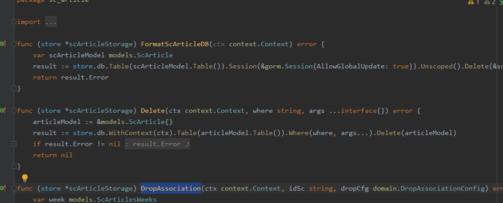
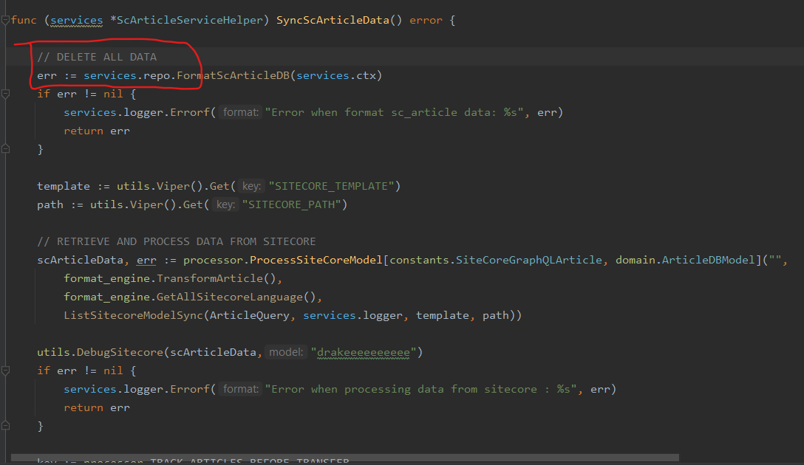
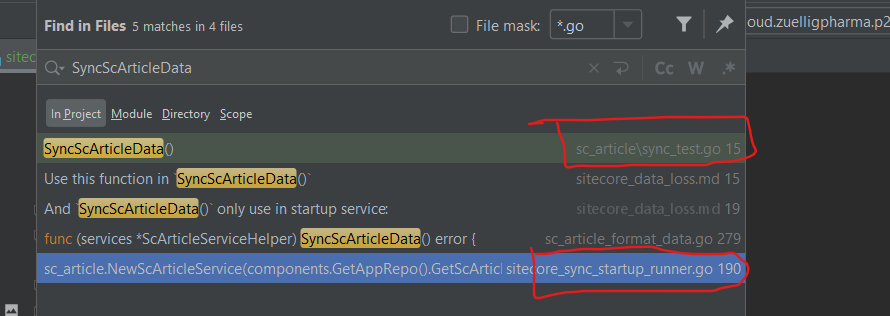
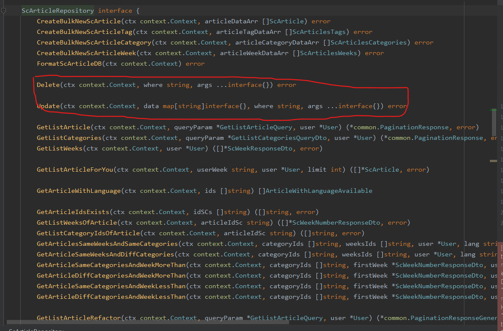
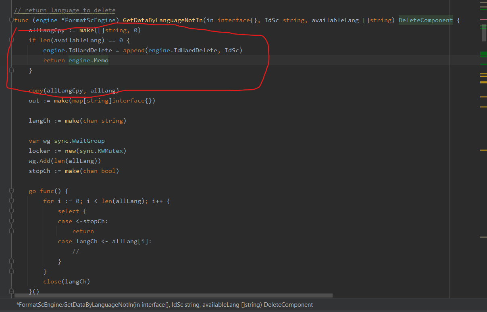
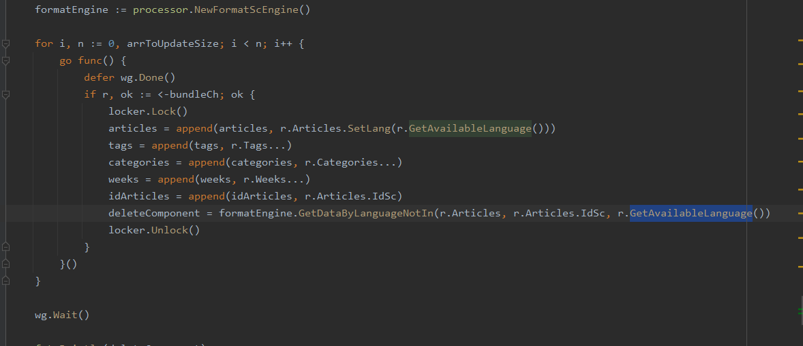
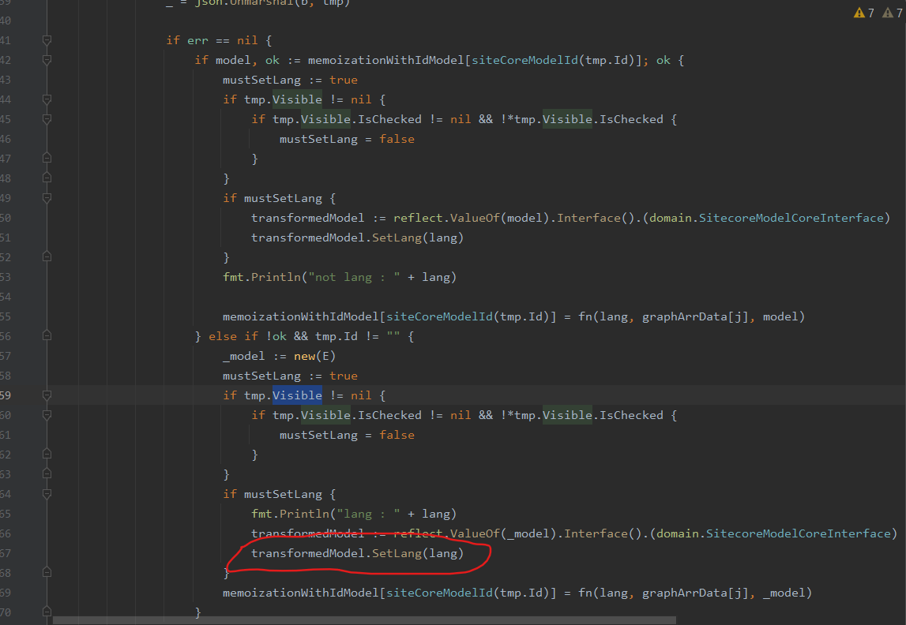

# Background

# Assumption

# Detail:
## locate delete function

1.Article only delete in repository:

2. where consume this function:

**For `FormatScArticleDB(ctx context.Context) error`**:

Use this function in `SyncScArticleData()`



And `SyncScArticleData()` only use in startup service and unit test file:



3. For `func (store *scArticleStorage) Delete(ctx context.Context, where string, args ...interface{}) error`

Use this only in webhook all_in_one service:

here is the function: 

```go
func (a *allInOneService) ProcessArticle(ctx context.Context, rootItemId string, idToDelete []string, resp *dto.GraphServiceResponse) error {
	repo := components.GetAppRepo().GetScArticleRepository()

	bundleCh := make(chan *domain.ArticleDBModel)
	deleteComponent := processor.InitMap()
	tags := make([]domain.ScArticlesTags, 0)
	weeks := make([]domain.ScArticlesWeeks, 0)
	categories := make([]domain.ScArticlesCategories, 0)
	articles := make([]domain.ScArticle, 0)

	idArticles := make([]string, 0)

	locker := new(sync.RWMutex)

	bundle, err := processor.ProcessSiteCoreModel[constants.SiteCoreGraphQLArticle, domain.ArticleDBModel](rootItemId,
		format_engine.TransformArticle(),
		format_engine.GetAllSitecoreLanguage(),
		nil)

	if err != nil {
		return err
	}
	var wg sync.WaitGroup

	stopCh := make(chan struct{})

	arrToUpdateSize, _ := processor.GetLength(bundle)

	if arrToUpdateSize == 0 {
		return nil
	}

	wg.Add(arrToUpdateSize)

	go func() {
		for i := 0; i < arrToUpdateSize; i++ {
			select {
			case <-stopCh:
				return
			case bundleCh <- bundle[i]:
			}
		}
		close(bundleCh)
	}()

	formatEngine := processor.NewFormatScEngine()

	for i, n := 0, arrToUpdateSize; i < n; i++ {
		go func() {
			defer wg.Done()
			if r, ok := <-bundleCh; ok {
				locker.Lock()
				articles = append(articles, r.Articles.SetLang(r.GetAvailableLanguage()))
				tags = append(tags, r.Tags...)
				categories = append(categories, r.Categories...)
				weeks = append(weeks, r.Weeks...)
				idArticles = append(idArticles, r.Articles.IdSc)
				deleteComponent = formatEngine.GetDataByLanguageNotIn(r.Articles, r.Articles.IdSc, r.GetAvailableLanguage())
				locker.Unlock()
			}
		}()
	}

	wg.Wait()

	fmt.Println(deleteComponent)

	articlePublishHandler := NewArticlePublishHandler(articles)

	articlePublishHandler.HandleArticlesAreNewWithLanguageVersionData(ctx)

	a.DebugExecutor = append(a.DebugExecutor, a.debug(articles, "sc_articles"))

	if err != nil {
		return err
	}

	errCh := make(chan error, 1)

	var wgSyncArticle sync.WaitGroup

	wgSyncArticle.Add(1)

	go func() {
		defer wgSyncArticle.Done()
		if len(articles) > 0 {
			err := repo.DropAssociationInBatches(ctx, format_engine.Map[domain.ScArticle, string](articles, func(a domain.ScArticle) string {
				return a.IdSc
			}), domain.DropAssociationConfig{
				DropWeek:     true,
				DropTag:      true,
				DropCategory: true,
			})

			if err != nil {
				fmt.Println(err)
			}
			//------------V1------------
			//err = repo.CreateBulkNewScArticle(
			//	ctx, articles)
			//------------V2------------
			err = repo.CreateBulkNewScArticle(
				ctx, validations.NewArticleHookValidation().OutputArticles(articles))
			if err != nil {
				errCh <- err
			}
		}
	}()

	wgSyncArticle.Wait()

	processor.HandleCoreDelete(deleteComponent, formatEngine.GetIdHardDelete(), repo)

	select {
	case e := <-errCh:
		return e
	default:
		tagAssociationHdl := func(c context.Context) error {
			if len(tags) > 0 {
				return validations.NewValidateArticleImpl(c, repo).WithTags(tags).CreateBulkNewScArticleTag()
			}
			return nil
		}
		categoriesAssociationHdl := func(c context.Context) error {
			if len(categories) > 0 {
				return validations.NewValidateArticleImpl(c, repo).WithCategories(categories).CreateBulkNewScArticleCategories()
			}
			return nil
		}

		weeksAssociationHdl := func(c context.Context) error {
			if len(weeks) > 0 {
				return validations.NewValidateArticleImpl(c, repo).WithWeeks(weeks).CreateBulkNewScArticleWeeks()
			}
			return nil
		}

		asyncJob := []async.Job{
			async.NewJob(tagAssociationHdl),
			async.NewJob(categoriesAssociationHdl),
			async.NewJob(weeksAssociationHdl),
		}

		jobs := async.NewGroup(true, asyncJob...)

		_err := jobs.RunJobs(ctx)

		if _err != nil {
			HandleErr(_err)
		}
	}

	articlePublishHandler.NotifyUser(ctx)

	//NewArticlePublishHandler(articles).NotifyUser(ctx)

	processor.DebugHolder().FreeMem()
	return nil
}
```

Let's deep dive into this function:
the delete function is executed inside this code:  `processor.HandleCoreDelete(deleteComponent, formatEngine.GetIdHardDelete(), repo)`

the `HandleCoreDelete` is :
```go
func HandleCoreDelete(component DeleteComponent, idScs []string, updateProcessor UpdateInterface) {
	if len(idScs) > 0 {
		err := updateProcessor.Delete(context.Background(), "id_sc in ?", idScs)
		if err != nil {
			fmt.Println(err)
		}
	}
	for _, v := range component {
		if len(v.IdSc) > 0 {
			err := updateProcessor.Update(context.Background(), v.UpdateData, "id_sc in ?", v.IdSc)
			if err != nil {
				fmt.Println(err)
			}
		}
	}
}
```

with `UpdateInterface` have two functions: `Update` and `Delete`

```go
type UpdateInterface interface {
	Update(ctx context.Context, data map[string]interface{}, where string, args ...interface{}) error
	Delete(ctx context.Context, where string, args ...interface{}) error
}
```

and repo that passed into function is `domain.ScArticleRepository` which also have two methods match with  `UpdateInterface`:



But the delete function will delete by condition, detail is:
`idScs` is array of article id must be hard deleted if the length is zero then implement update.
**So when `idScs` is not empty?**
It's when the article get from sitecore have no language version:

When when the article get from sitecore have no language version?
It's case when `Visible keyword is false or null`
Or else it will add available language to that model io: `sc_articles`


`sc_articles` model have `AvailableLanguage` properties indicate that the specific article object have many version of languages? ex: `en`,`my-MM` or ,`km-KH`

```go
	type ScArticle struct {
		Id                 int64  `json:"id,omitempty"`
		IdSc               string `json:"id_sc,omitempty"`
		IdScTargetAudience string `json:"id_sc_target_audience,omitempty"`
		Name               string `json:"name,omitempty"`
		DisplayName        string `json:"display_name,omitempty"`
		Video              string `json:"video,omitempty"`

		TitleEn            string `json:"title_en,omitempty"`
		ShortDescriptionEn string `json:"short_description_en,omitempty"`
		ThumbnailEn        string `json:"thumbnail_en,omitempty"`
		AuthorEn           string `json:"author_en,omitempty"`
		VerifierEn         string `json:"verifier_en,omitempty"`
		BodyEn             string `json:"body_en,omitempty"`
		PublishedDateEn    string `json:"published_date_en,omitempty"`

		TitleKm            string `json:"title_km,omitempty"`
		ShortDescriptionKm string `json:"short_description_km,omitempty"`
		ThumbnailKm        string `json:"thumbnail_km,omitempty"`
		AuthorKm           string `json:"author_km,omitempty"`
		VerifierKm         string `json:"verifier_km,omitempty"`
		BodyKm             string `json:"body_km,omitempty"`
		PublishedDateKm    string `json:"published_date_km,omitempty"`

		TitleMy            string `json:"title_my,omitempty"`
		ShortDescriptionMy string `json:"short_description_my,omitempty"`
		ThumbnailMy        string `json:"thumbnail_my,omitempty"`
		AuthorMy           string `json:"author_my,omitempty"`
		VerifierMy         string `json:"verifier_my,omitempty"`
		BodyMy             string `json:"body_my,omitempty"`
		PublishedDateMy    string `json:"published_date_my,omitempty"`

		Tags            []ScTag           `json:"tags"`
		Categories      []*ScCategory     `json:"categories"`
		Weeks           []ScWeek          `json:"weeks"`
		TargetAudiences *ScTargetAudience `json:"target_audiences"`

		AvailableLanguage []string

		IsFavorite *bool `json:"is_favorite"`
	}
```